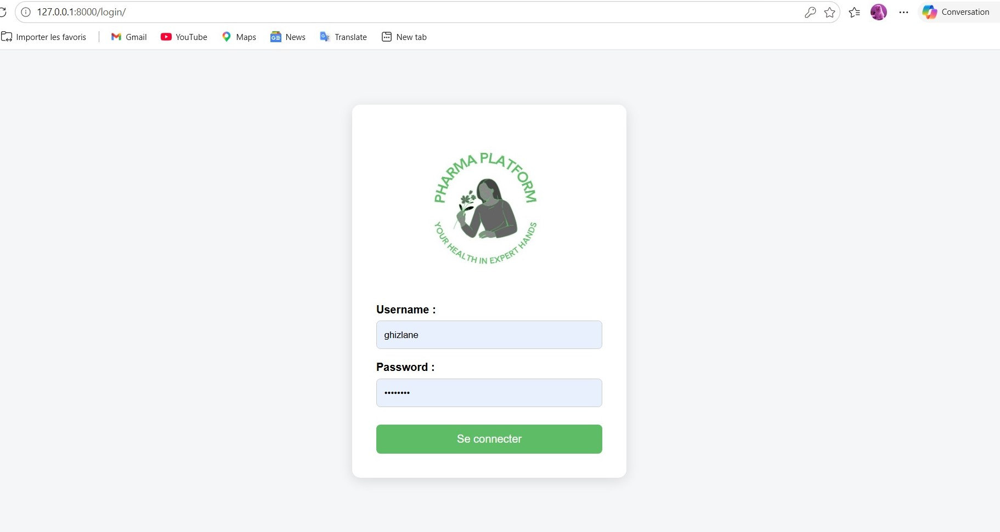
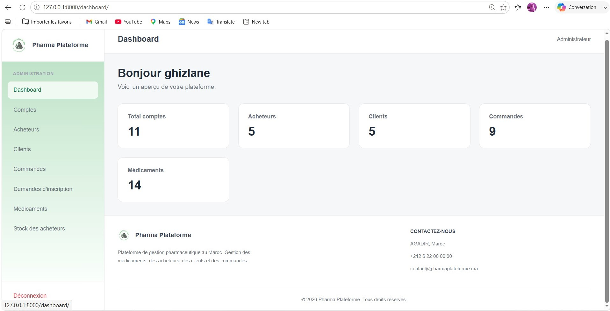
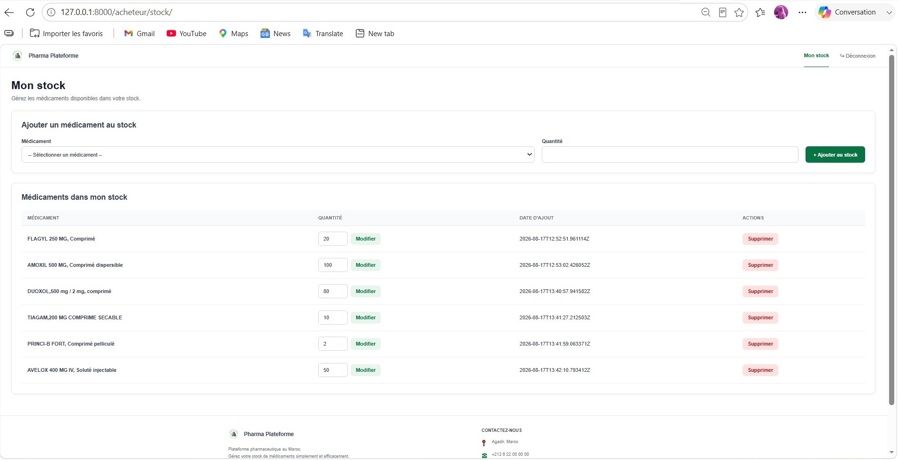
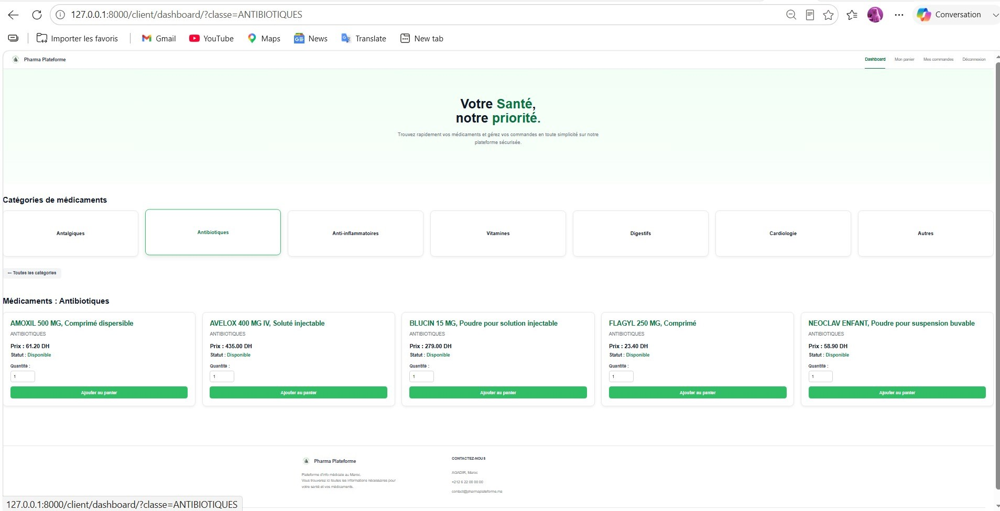

 Pharma Platform

A web-based pharmaceutical management platform developed during an internship at SOREMED.

---

Projects Overview

Pharma Platform is a web application designed to facilitate the management of pharmaceutical activities through a centralized digital platform.

The application provides role-based access and separates the frontend from the backend through a REST API.

Main Objectives

- Centralize pharmaceutical management operations
- Manage users according to their roles
- Manage buyers and clients
- Manage medicines and orders
- Provide secure authentication
- Enable communication between frontend and backend through a REST API
- Containerize the application using Docker

---

## Application Preview

### Admin Login



### Admin Dashboard



### Acheteur Management



### Client Management



---

 Key Functional Modules

 Authentication & Authorization

- Secure user authentication
- JWT-based authentication
- Role-based access control

 Buyer Management

- Create buyers
- View buyers
- Update buyer information
- Activate or deactivate buyer accounts

 Client Management

- Manage client accounts
- View client information
- Manage client-related operations

 Medicine Management

- Manage available medicines
- Manage quantities
- Manage pharmaceutical resources

 Order Management

- Manage orders
- Track order information
- Manage order history

 Services Management

- Manage available services
- View service information
- Manage services from the administration interface

---

 System Architecture

The application follows a frontend/backend architecture.

                         User
                          │
                          ▼
                  ┌───────────────┐
                  │    Frontend   │
                  │     Django    │
                  │    Templates  │
                  └───────┬───────┘
                          │
                     HTTP / REST
                          │
                          ▼
                  ┌───────────────┐
                  │    Backend    │
                  │ Django + DRF  │
                  └───────┬───────┘
                          │
                          ▼
                  ┌───────────────┐
                  │   Database    │
                  │    SQLite     │
                  └───────────────┘

 Docker Architecture

The application components are containerized using Docker and managed with Docker Compose.
```text
┌─────────────────────────────────────────────┐
│               Docker Compose                │
│                                             │
│  ┌──────────────┐       ┌──────────────┐   │
│  │   Frontend   │       │   Backend    │   │
│  │    Django    │──────►│ Django / DRF │   │
│  │    :8000     │ REST  │    :8001     │   │
│  └──────────────┘       └──────┬───────┘   │
│                                │           │
│                                ▼           │
│                         ┌─────────────┐    │
│                         │   SQLite    │    │
│                         │  Database   │    │
│                         └─────────────┘    │
└─────────────────────────────────────────────┘
```
---

 Technology Stack

Backend

-  Python
- Django
- Django REST Framework
- JWT

Frontend

- HTML5
- CSS3
- Django Templates

Database

- SQLite

DevOps & Tools

- Docker
- Docker Compose
- Git
- GitHub
- Postman
- Visual Studio Code

 Project Structure

```text
pharma_platform/
│
├── backend/
│   ├── config/
│   ├── accounts/
│   ├── manage.py
│   └── requirements.txt
│
├── frontend/
│   ├── admin_panel/
│   ├── templates/
│   └── static/
│
├── screenshots/
│   ├── login.png
│   ├── dashboard.png
│   ├── acheteurs.png
│   └── clients.png
│
├── Dockerfile
├── docker-compose.yml
├── .gitignore
└── README.md

```

 Configuration Details

User Roles

The application defines three main user roles:

ADMIN
ACHETEUR
CLIENT

Each role has access to specific functionalities according to its permissions.

Authentication

The backend uses JWT authentication to secure API access.

Docker

Docker and Docker Compose are used to create and manage the application's containers.

---

 Installation

1. Clone the repository

git clone https://github.com/Ghizlane-g/pharma_platform.git

2. Navigate to the project

cd pharma_platform

3. Build the Docker containers

docker compose build

4. Start the application

docker compose up --build

5. Access the application

Once the containers are running, open the application using the configured local port.

---

 Author

FATTOUR GHIZLANE

Engineering Student — Software & Application Development

ENSA Agadir — Université Ibn Zohr

 Agadir, Morocco

GitHub:
https://github.com/Ghizlane-g
Email:
ghizlanefattour139@gmail.com

---